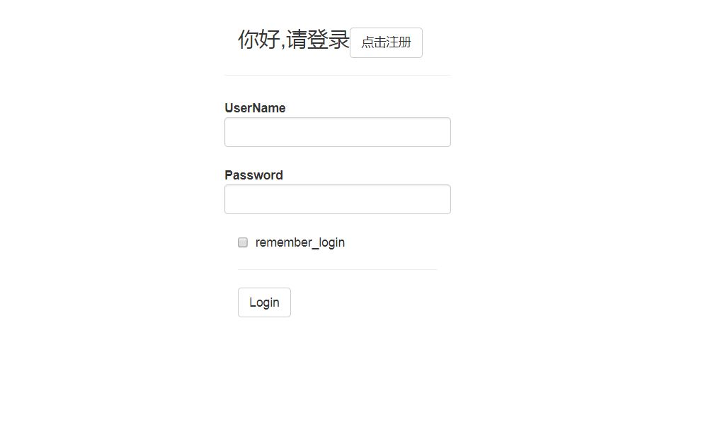
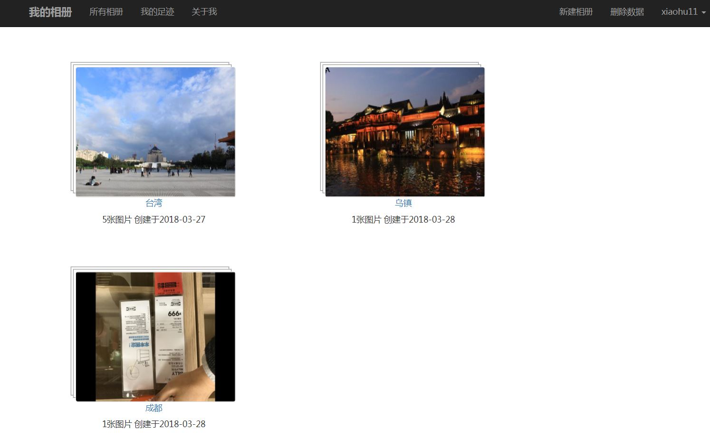
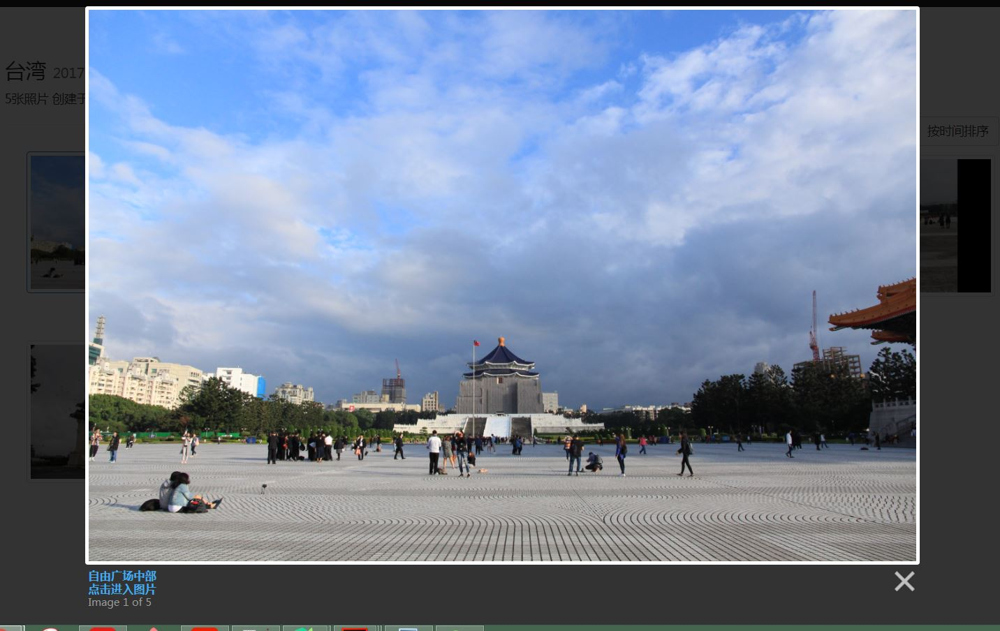
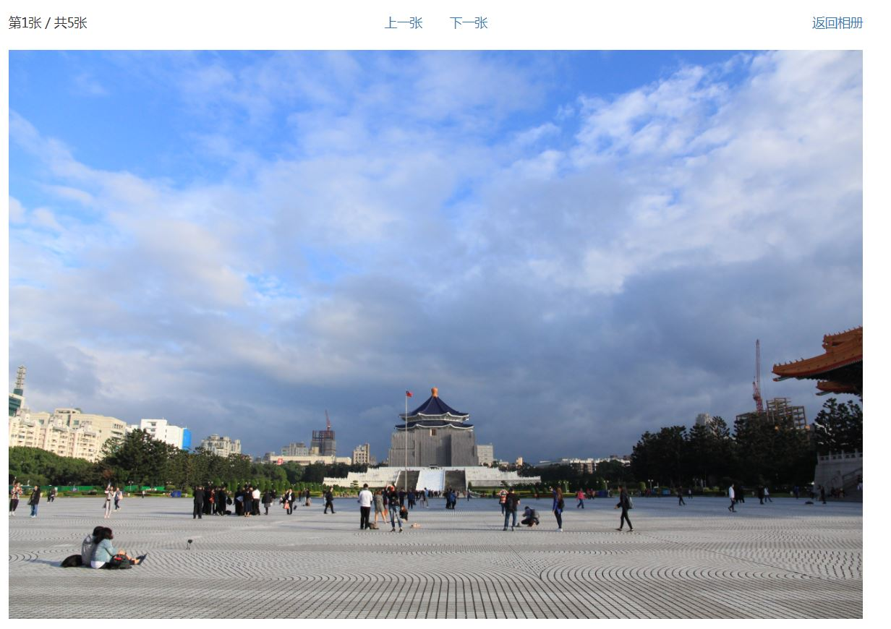

# 我的个人相册

基于BootStrap+Flask+MongoDB搭建的在线相册，照片采用GridFS直接存储于Mongo中，相册整体风格借鉴豆瓣相册
支持批量上传，编辑照片，支持相册进行LightBox快速浏览，支持按相册地理位置信息显示相册足迹

## 相册截图

## 使用指导
安装相关依赖包: pip install -r requirements.txt
直接运行APP: python runserver.py

也可以访问url(https://xiaohu89album.herokuapp.com/)来使用在线相册APP

